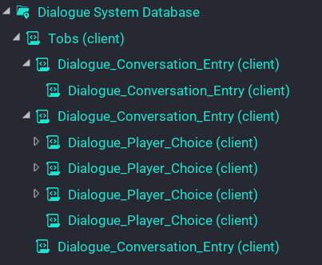

# Quick Start

If you just want to get right in with a high level overview of how to use this system, then follow the steps below. Otherwise I would take the time to read some of the other pages of the documentation and definitely try out the examples that come with the system to see how it works and how those were setup.

1. Drag the template `Dialogue System` into the hierarchy.
2. Under your NPC characters as the first child, drag the template `Dialogue Trigger` into the hierarchy and setup the trigger volume size / position.
3. Create a `Client Context` folder which will become the database for the dialogue system.
4. Drag the script `Dialogue_Conversation` into the database folder and setup the properties.
5. Drag the script `Dialogue_Conversation_Entry` as a child of the `Dialogue_Conversation` script. Repeat for branches and sub branches.
6. For player choices, drag the `Dialogue_Player_Choice` script as child of either existing choice scripts or entry scripts.
7. Drag the database folder onto the property of the `Dialogue System` folder.

!!! tip
	For proper understanding of the hierarchy when creating dialogue branches and choices, I would suggest reading the documentation to understand it more, or checkout the examples that come with the system to see how they are setup.

Below is an example structure of the NPC `Tobs` in the advanced example.

!!! note
	The script `Dialogue_Conversation` is renamed in the example to the NPC name. This makes it much easier when you have a lot of conversations setup for different characters.

