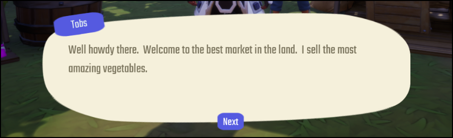
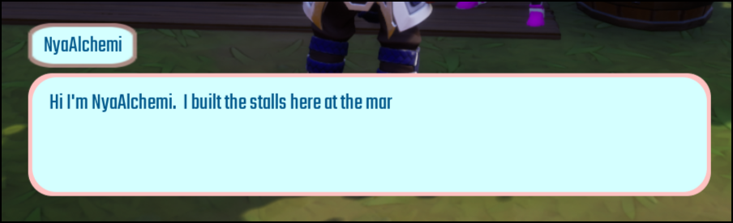
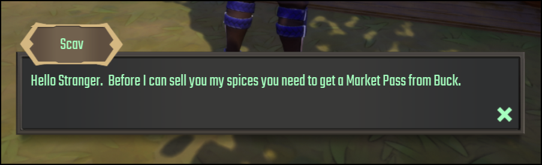
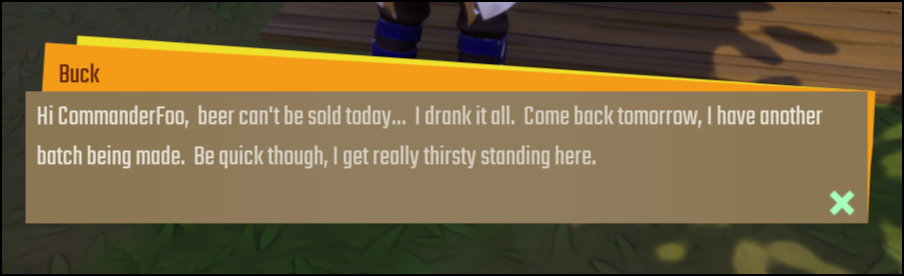
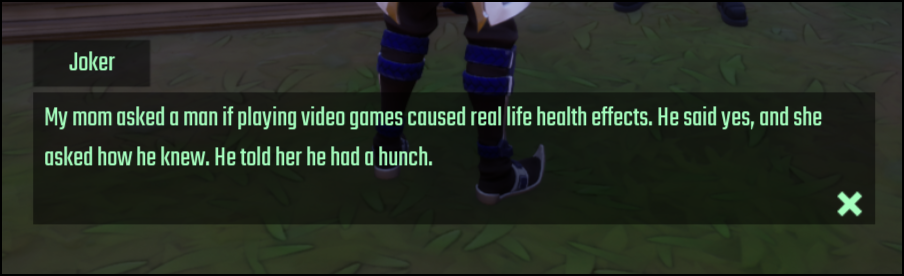

# Themes

All themes require certain elements. Each theme has properties on the root object which are.

| Property Name | Description |
| ------------- | ----------- |
| `name` | The `UIText` object that will be used to display the NPC / "You" name. |
| `text` | The `UIText` object that will be used to display the NPC text to the player. |
| `choices_panel` | The `UIPanel` object that will be the container for the choices. |
| `close_button` | The `UIButton` object that will be used to close the dialogue. |
| `next_button` | The `UIButton` object that will be used to go to the next entry in the conversation. |

Below are the themes that come with the system. These can be used as a base to work from for creating a unique dialogue for your own game. The `Basic Theme` is the most basic version that is a good starting point if you want to design your own.

**Bubbly Theme** 

**Simple Theme** 

**Corehaven Theme** 

**Persona Theme** 

**Basic Theme** 

