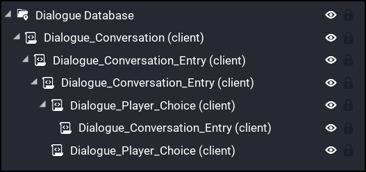

# 7. Conversation Choices

For our next dialogue with our NPC, we will add 2 player choices.

 1. **Do you have any Cookies?** This choice will also have a `Dialogue_Conversation_Entry` as a child so that the NPC can respond to the players choice.

 2. **Goodbye.** This choice will end the conversation.

<iframe width="560" height="315" src="https://www.youtube.com/embed/xi3lps2VQXA" title="YouTube video player" frameborder="0" allow="accelerometer; autoplay; clipboard-write; encrypted-media; gyroscope; picture-in-picture" allowfullscreen></iframe>

 Here's a look at the hierarchy structure.

 
