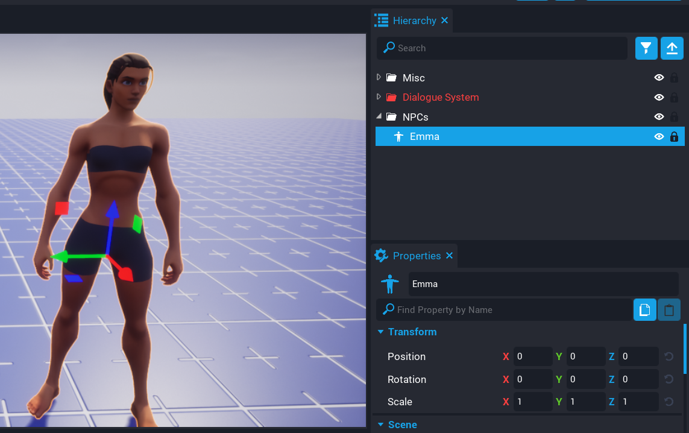

# 2. Create NPC

In this tutorial we are going to create a Non-Player Character (NPC) that eventually we will be able to walk up to and have a conversation with.

<iframe width="560" height="315" src="https://www.youtube.com/embed/xTHNqrwGi9o" title="YouTube video player" frameborder="0" allow="accelerometer; autoplay; clipboard-write; encrypted-media; gyroscope; picture-in-picture" allowfullscreen></iframe>

Grab a character or whatever object you want the player to talk too, and drop it into the hierarchy.

!!! tip
	I would recommend naming your character and also placing it into a folder called `NPCs`.

