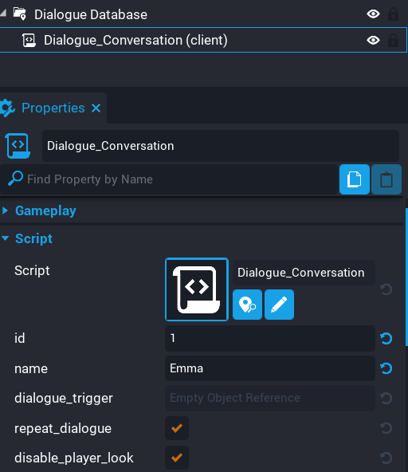

# 4. NPC Conversation

Next we are going to drag the `Dialogue_Conversation` script into the database folder and setup some properties. This script is the entry point for our new NPC. Each NPC you create needs one of these scripts which acts as a data container.

We will set the `id` and `name` properties.

!!! warn
	The `id` for each `Dialogue_Conversation` script needs to be unique.

<iframe width="560" height="315" src="https://www.youtube.com/embed/gfL-4XCXRg8" title="YouTube video player" frameborder="0" allow="accelerometer; autoplay; clipboard-write; encrypted-media; gyroscope; picture-in-picture" allowfullscreen></iframe>

