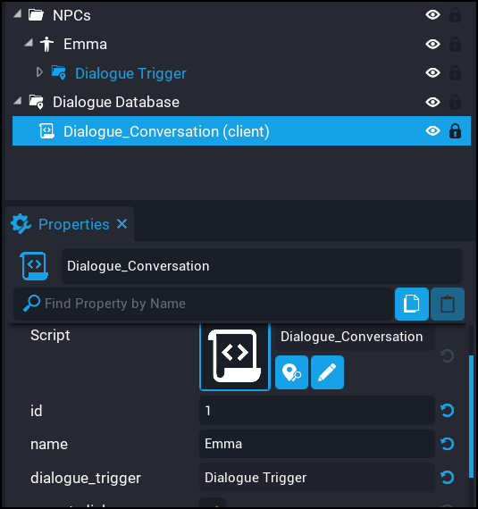

# 5. NPC Trigger

We need to add a trigger to the NPC so that we can interact with it. The `Dialogue System` comes with a template called `Dialogue Trigger` that has specific properties on it that the system looks at. It's very important that this trigger is a direct child of the NPC, otherwise some aspects of the system may not work correctly.

After the trigger has been added to the NPC, modify the position, size, and interaction label. Then drag the the `Dialogue Trigger` folder onto the `dialogue_trigger` property of the `Dialogue_Conversation` in the database folder.

!!! tip
	Rename `Dialogue_Conversation` to the name of your NPC so it's easier to keep track of which conversations are for which NPCs.

<iframe width="560" height="315" src="https://www.youtube.com/embed/Cb3Ne0xzxRQ" title="YouTube video player" frameborder="0" allow="accelerometer; autoplay; clipboard-write; encrypted-media; gyroscope; picture-in-picture" allowfullscreen></iframe>

